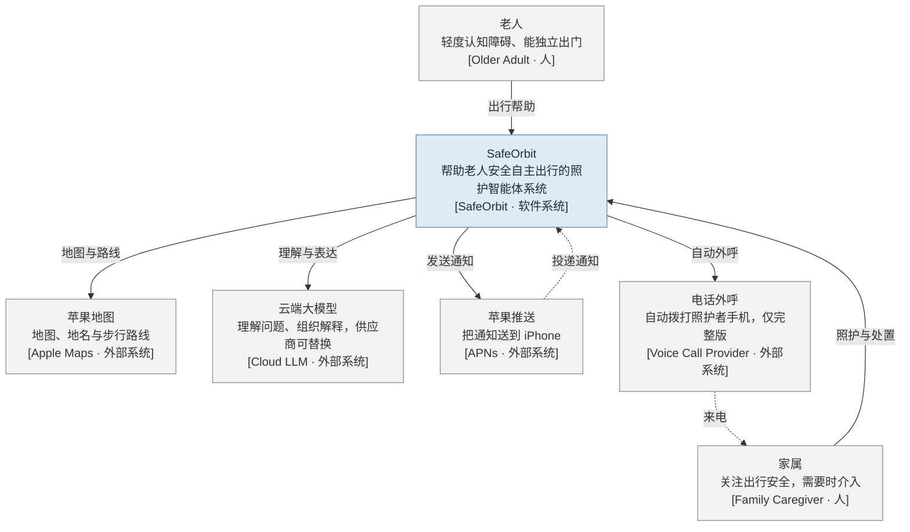
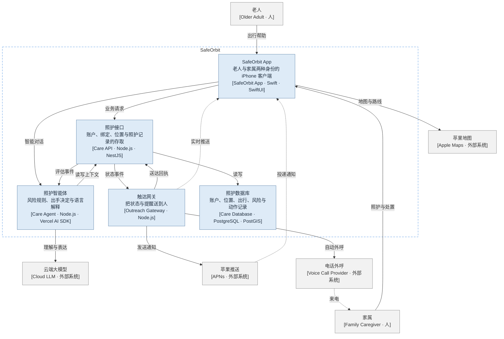
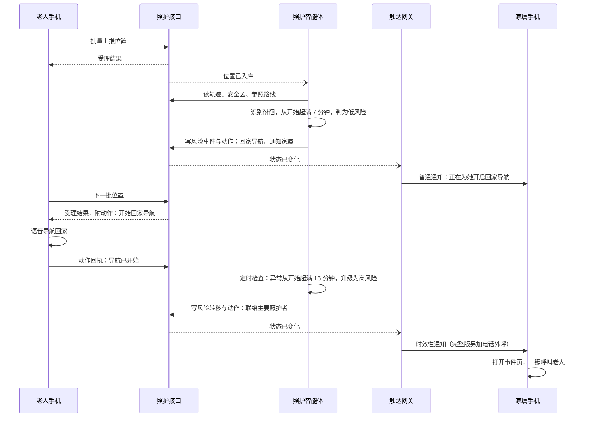
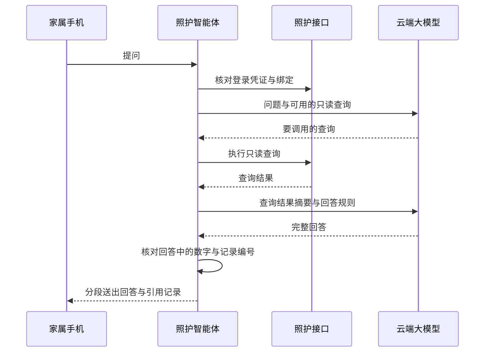

# 工程架构

状态：已确认，以任务 T2 通过为准；第 9 节“大模型供应商”一条除外。
最后复核：2026-10-01。
确认依据：用户分批裁决全部待确认事项，并约定修订后的文档以任务 [T2](../queue/tasks/T2/goal.md) 通过为准（D42）。

## 阅读说明

- 本文回答“系统怎么搭”：由哪些部分组成、各管什么、怎么协作、Demo 怎么落地。产品行为以[产品设计](产品设计.md)为准，本文不重复描述界面。
- 本文同时是制图工具的承载设计文档：第 4、5 节的两张图以文本图源写在本文中，渲染产物与 Demo 部署视图在图纸区 [truth/architecture/](architecture/AGENTS.md)。改图须按[《架构设计与制图规范》](architecture/架构设计与制图规范.md)先改图源、再改边表。
- 边表的线型记号：→ 实线＝写与调用的发起；⇢ 虚线＝只读、投递或可选通道。实线边写“接口｜归属｜同步或异步｜耦合”，虚线边写“供给｜触发”。
- “D1”等编号指任务 T2 批准基线里的已定决定（D1–D42）。尚未决定的地方就地标【待确认】，并列在文末“待确认事项”；目前只有大模型供应商一条（D39）。
- 只能靠真机回答的技术问题不列为待确认，集中在第 15 节“开发初期验证项”，由第一个开发任务实测（D36）。
- “完整版”指 PPT 展示的架构，“Demo”指本阶段实际开发的简化版（D1）。参考资料（索引见 [reference/README.md](../reference/README.md)）里的具体数字、接口与表结构只作候选实现细节（D19）。

## 1 总览：一套逻辑架构，两种部署

完整版与 Demo 共用同一套逻辑架构：一个 iPhone App，加上后端的照护接口、照护智能体、触达网关三个部分，以及一个数据库。除下表所列差异外，两版相同：

| 方面 | 完整版（PPT） | Demo（开发） |
| --- | --- | --- |
| 后端 | 照护接口、照护智能体、触达网关各自独立部署 | 合成一个 NestJS 程序，三者是程序内的模块，边界不变（D16） |
| 高风险联络 | 强提醒加服务器自动外呼 | 强提醒加事件页一键呼叫，不接电话外呼（D8） |
| 人数关系 | 一位家属可关注多位老人 | 只支持一位老人（D13） |
| 运行环境 | 服务器 | 开发者自己的电脑，Docker 启动（D15） |
| 历史数据 | 真实积累 | 开发工具灌入一个月模拟历史（D14） |

D16 所说的“实时同步”容器即本文的触达网关；苹果推送与电话外呼的送达也并入它，使“把消息送到人”集中在一处（D34）。

第 4、5 节的 C1、C2 图画的是完整版；Demo 的落地方式见第 6 节与部署视图。严格按 C4 的定义，Demo 中合进同一程序的三部分只是模块；本文仍按完整版的容器边界描述它们的职责与接口，因为模块之间的接口与完整版容器之间的接口一一对应，日后拆开时只把函数调用换成网络调用。

## 2 架构原则

1. **风险只由规则判定**：异常识别、风险定级、出手动作只由照护智能体里的固定规则决定，结果可复现。大模型、客户端点击与通知结果都不能直接改风险等级（D4）。
2. **大模型只读不写**：大模型经少量只读查询取数，只负责理解问题、组织解释；回答里的数字与记录必须能在查询结果中核对。它不碰数据库，也没有写操作或拨号一类的工具（D4）。
3. **数据只有一个主人**：只有照护接口读写照护数据库；照护智能体与触达网关经照护接口存取数据，不直接访问数据库。
4. **“已发出”不等于“已帮到”**：导航、推送、电话各自记录实际结果；接了电话不等于家属已接手，接手也不等于风险已解除。
5. **数据中断不等于有风险**：出行途中定位缺失时挂“监测受限”，既不判为风险，也不据此解除风险（D6、D21）。
6. **供应商可替换**：地图、大模型、推送、电话各经一个适配器接入；换供应商只换适配器，不改业务规则（D17）。
7. **模块边界由检查把守**：Demo 合成一个程序后，模块之间只经约定接口与事件交互，由依赖检查拒绝越界引用（D16）。

## 3 统一命名

图上、边表、代码模块统一用下表的名字。改名按规范第 6 节作为结构变更处理。PPT 初稿用名的改动属于第 13 节的修订清单。

| 类别 | 中文名 | 英文名 | PPT 初稿用名 |
| --- | --- | --- | --- |
| 人 | 老人 | Older Adult | Older Adult with MCI |
| 人 | 家属 | Family Caregiver | Family Caregiver |
| 本系统 | SafeOrbit | SafeOrbit | SafeOrbit |
| 容器 | SafeOrbit App | SafeOrbit App | Older Adult APP |
| 容器 | 照护接口 | Care API | API Aplication |
| 容器 | 照护智能体 | Care Agent | Agent Service |
| 容器 | 触达网关 | Outreach Gateway | Care Mesh |
| 容器 | 照护数据库 | Care Database | Database |
| 外部系统 | 苹果地图 | Apple Maps | GIS |
| 外部系统 | 云端大模型 | Cloud LLM | Cloud LLM Service |
| 外部系统 | 苹果推送 | APNs | 无 |
| 外部系统 | 电话外呼 | Voice Call Provider | 无 |

## 4 C1 系统语境图

| # | 边 | 完整语义与依据 |
| --- | --- | --- |
| 1 | 老人 → SafeOrbit：出行帮助 | 接口：老人手机上的 App——“回家”“联系家人”两个按钮，以及低风险时自动开启的语音导航｜归属：SafeOrbit｜耦合：无（非程序调用）。依据：D3、D5、D11 |
| 2 | 家属 → SafeOrbit：照护与处置 | 接口：家属手机上的 App——看位置与记录、收提醒、呼叫老人、确认已会合、向智能体提问｜归属：SafeOrbit｜耦合：无（非程序调用）。依据：D3、D8 |
| 3 | SafeOrbit → 苹果地图：地图与路线 | 接口：显示地图、反查地名、规划步行路线(起点, 终点) → 路线与转向步骤｜归属：SafeOrbit，由地图适配器实现｜同步｜耦合：源码依赖。依据：D17 |
| 4 | SafeOrbit → 云端大模型：理解与表达 | 接口：生成回答(问题, 查询结果摘要, 回答规则) → 文本；生成解释(风险证据) → 文本｜归属：SafeOrbit，由大模型适配器实现｜同步｜耦合：源码依赖。依据：D4、D17 |
| 5 | SafeOrbit → 苹果推送：发送通知 | 接口：发送通知(设备令牌, 本地化文案键, 级别) → 受理结果｜归属：SafeOrbit，由推送适配器实现｜异步｜耦合：源码依赖。依据：D7、D8 |
| 6 | 苹果推送 ⇢ SafeOrbit：投递通知 | 供给：通知送到家属手机上的 App——低风险普通通知、高风险时效性通知、解除通知｜触发：苹果推送受理之后，送达时间不由本系统控制。依据：D8 |
| 7 | SafeOrbit → 电话外呼：自动外呼 | 接口：发起外呼(号码, 提示语) → 呼叫编号，另收状态回调｜归属：SafeOrbit，由外呼适配器实现｜异步｜耦合：源码依赖。仅完整版。依据：D8 |
| 8 | 电话外呼 ⇢ 家属：来电 | 供给：主要照护者的手机响铃并播报风险提示｜触发：高风险成立、外呼发起之后。仅完整版。依据：D8 |

## 5 C2 容器图（完整版）

| # | 边 | 完整语义与依据 |
| --- | --- | --- |
| 1 | 老人 → SafeOrbit App：出行帮助 | 接口：老人身份界面｜归属：SafeOrbit App｜耦合：无（非程序调用）。C1 边 1 |
| 2 | 家属 → SafeOrbit App：照护与处置 | 接口：家属身份界面｜归属：SafeOrbit App｜耦合：无（非程序调用）。C1 边 2 |
| 3 | SafeOrbit App → 照护接口：业务请求 | 接口：登录与绑定；批量上报位置(设备, 点列表, 电量) → 逐点受理结果，并在回复中带回待执行动作（如开始回家导航）；上传参照路线（家属手机规划的“家 ↔ 安全区”步行路线）；查询出行、日历、趋势与风险事件；管理安全区；提交动作回执与处置（确认已会合、标为误报）｜归属：照护接口｜同步｜耦合：源码依赖。HTTP(S) 与 JSON，Demo 的局域网连接见第 6 节。依据：D3、D8、D9、D10 |
| 4 | SafeOrbit App → 照护智能体：智能对话 | 接口：提问(问题, 语言) → 回答与引用的记录编号；回答整段生成、核对通过后再分段送出｜归属：照护智能体｜同步｜耦合：源码依赖。照护智能体校验照护接口签发的登录凭证，并经照护接口核对绑定关系。依据：D4 |
| 5 | SafeOrbit App → 苹果地图：地图与路线 | 接口：显示地图、反查地名、规划步行路线｜归属：SafeOrbit App，由地图适配器实现｜同步｜耦合：源码依赖。C1 边 3 |
| 6 | 照护接口 → 照护数据库：读写 | 接口：读写账户、绑定、位置、出行、安全区、参照路线、风险事件、处置、动作与送达记录｜归属：照护接口，唯一读写者｜同步｜耦合：源码依赖。依据：第 2 节原则 3 |
| 7 | 照护接口 → 照护智能体：评估事件 | 接口：订阅“位置已入库(老人编号, 批次序号)”与“处置已提交(风险事件编号, 处置类型)”｜归属：照护接口，事件口由它定义｜异步｜耦合：两者反向，照护接口的源码不认识照护智能体。另有照护智能体内部的定时检查，不经本边 |
| 8 | 照护智能体 → 照护接口：读写上下文 | 接口：读取轨迹、出行、安全区、参照路线、处置记录与统计；核对家属与老人的绑定关系；写入行为观测、风险事件与转移、出手动作、事件解释；保存对话记录；风险转移与出手动作在同一次调用中写入｜归属：照护接口｜同步｜耦合：源码依赖。依据：D4、D9；绑定核对与对话记录见任务 [T4](../queue/tasks/T4/goal.md) |
| 9 | 照护智能体 → 云端大模型：理解与表达 | 接口：生成回答与解释，见 C1 边 4｜归属：照护智能体，由大模型适配器实现｜同步｜耦合：源码依赖。C1 边 4 |
| 10 | 照护接口 → 触达网关：状态事件 | 接口：订阅“状态已变化(老人编号, 序号, 类型)”，类型含位置快照、风险变化、出手动作｜归属：照护接口，事件口由它定义｜异步｜耦合：两者反向 |
| 11 | 触达网关 → 照护接口：送达回执 | 接口：记录送达(动作编号, 渠道, 结果)｜归属：照护接口｜同步｜耦合：源码依赖。依据：第 2 节原则 4 |
| 12 | 触达网关 ⇢ SafeOrbit App：实时推送 | 供给：位置快照、风险变化与动作状态｜触发：App 在前台、长连接在线时，状态一变即推；断线后 App 凭序号向照护接口补取 |
| 13 | 触达网关 → 苹果推送：发送通知 | 接口：发送通知(设备令牌, 本地化文案键, 级别)，高风险用时效性级别｜归属：触达网关，由推送适配器实现｜异步｜耦合：源码依赖。C1 边 5 |
| 14 | 苹果推送 ⇢ SafeOrbit App：投递通知 | 供给：通知送到家属手机，按手机系统语言显示，点开进入位置页或事件页｜触发：苹果推送受理之后。C1 边 6 |
| 15 | 触达网关 → 电话外呼：自动外呼 | 接口：发起外呼(主要照护者号码, 提示语)，另收状态回调｜归属：触达网关，由外呼适配器实现｜异步｜耦合：源码依赖。仅完整版。C1 边 7 |
| 16 | 电话外呼 ⇢ 家属：来电 | 供给：主要照护者手机响铃并播报风险提示｜触发：高风险成立、外呼发起之后。仅完整版。C1 边 8 |

容器职责：

| 容器 | 负责 | 不负责 |
| --- | --- | --- |
| SafeOrbit App | 两种身份的界面；老人手机的后台定位、批量上报与语音导航执行；家属手机的展示、处置与参照路线规划 | 判断风险 |
| 照护接口 | 账户与绑定、位置接收、出行与照护记录的存取、日历与趋势统计、发布评估事件与状态事件 | 判断风险、决定是否提醒 |
| 照护智能体 | 出行识别、异常识别、风险定级、出手决定、定时检查、常走路线学习、事件解释与智能对话 | 存储数据、把消息送到人 |
| 触达网关 | 实时推送、通知与外呼的送达，以及送达结果回报 | 决定何时提醒、提醒谁 |
| 照护数据库 | 持久保存全部业务数据 | 业务判断 |

风险数据的接口归属（D34）：风险规则在照护智能体，风险记录经照护接口定义的接口存取，照护接口是全部业务记录的主人。这与《架构设计与制图规范》第 4 节“接口归持有规则的一侧”有出入，是为结构简单、与原则 3 一致而接受的已知取舍；完整版若把照护智能体独立部署后风险数据增多，再考虑改由照护智能体定义风险记录口。

## 6 Demo 版：简化与部署

Demo 由完整版简化而来，逻辑边界不变（D16）：

| 完整版容器 | Demo 中的形态 |
| --- | --- |
| SafeOrbit App | 同一个 App，装在两部 iPhone 上，分别选老人身份与家属身份 |
| 照护接口 | 后端程序中的“照护接口”模块 |
| 照护智能体 | 后端程序中的“照护智能体”模块 |
| 触达网关 | 后端程序中的“触达网关”模块，只接苹果推送，不接电话外呼 |
| 照护数据库 | Docker 中的 PostgreSQL 加 PostGIS |
| 电话外呼 | 不接；高风险由家属端强提醒与一键呼叫代替（D8） |

部署：开发者电脑上用 Docker 启动后端程序与数据库；两部 iPhone 与电脑连同一个 Wi‑Fi；App 里的服务器地址可配置；需要真人上街采集时再加内网穿透，并先彩排（D15）。

两部 iPhone 经局域网 IP 连接开发者电脑，服务器地址写在 App 的构建配置里；连接的具体做法见第 15 节验证项。

模块边界：照护智能体与触达网关模块只能引用照护接口模块公开的接口与事件；照护接口模块不得引用它们；任何模块不得绕过照护接口直接访问数据库。用 dependency-cruiser 写成规则，违反即检查失败（D34）。

#### 容器指针表

| 容器 | 详设文档 | 图源 |
| --- | --- | --- |
| Demo 部署视图 | [architecture/safeorbit-demo-deployment/safeorbit-demo-deployment.md](architecture/safeorbit-demo-deployment/safeorbit-demo-deployment.md) | architecture/safeorbit-demo-deployment/safeorbit-demo-deployment.mmd（部署型，物理落位视图，非容器分解） |
| 照护智能体 | [architecture/safeorbit-care-agent/safeorbit-care-agent.md](architecture/safeorbit-care-agent/safeorbit-care-agent.md) | architecture/safeorbit-care-agent/safeorbit-care-agent.mmd |

C3 组件图的评估（任务 [T4](../queue/tasks/T4/goal.md)）：C1、C2 定稿后按区规则逐个容器评估，只给照护智能体画组件图——它持有必须守住的业务规则（风险只由规则判定，大模型只读不写），内部部件多于三个。其余不画：照护接口以数据存取为主，触达网关部件少且全是技术转发，SafeOrbit App 不判风险、内部以界面与系统功能调用为主，照护数据库不适用。

## 7 关键流程

以下为说明图，不受图纸检查。

低风险到高风险：

智能对话：

风险解除有两条路径：照护智能体在新位置或定时检查中发现老人回到家或参照路线并持续正常，写入解除转移；家属提交“确认已会合”后，照护接口发布“处置已提交”事件，照护智能体据此写入解除转移，老人手机离线时也能解除。两条路径都会取消未执行的旧动作，并由触达网关推送解除通知。

## 8 风险规则（照护智能体）

规则在三种时机运行：新位置入库、家属提交处置、定时检查（每 30 秒检查一次进行中的出行与风险）。定时检查让“持续多久”一类的判定在没有新位置时也能推进。规则按位置点的采样时间计时，不按服务器的接收时间，所以回放历史时也能得到同样的结果。

处理顺序：

1. **数据质量**：过滤精度差、时间乱序、明显跳点的位置。出行途中长时间没有有效位置时挂“监测受限”；App 检测到定位或“精确位置”权限被关闭时，在下次上报中报告，立即挂“监测受限”。老人在家时不判监测受限。
2. **出行识别**：在家、外出候选、出行中、已结束四种状态；进出“家”的判定加边界余量，防止在边界附近来回跳。
3. **异常识别**：徘徊、长时间停留、来回折返、偏离路线，输出带证据窗口的行为观测；异常移动模式 Demo 不做（D25）。
4. **风险定级**：正常 → 低风险 → 高风险；持续时间从异常开始算起；高风险不自动降级；解除为一次转移。同一位老人同一时间只有一条进行中的风险事件；写入时核对版本，防止并发重复。
5. **出手决定**：按产品设计第 3.4 节的对应关系生成动作，每个动作带有效期与幂等键，重复处理不会重复出手。
6. **常走路线学习**：出行全程无风险才学入（D9）。

Demo 默认参数（D22、D35），均可配置，真机测试后可调：

| 参数 | Demo 默认值 | 来源 |
| --- | --- | --- |
| 家的判定余量 | 安全区半径上下各 20 米 | 工程文档建议 |
| 确认外出 | 连续 3 个有效点、持续 60 秒、位移 50 米 | 工程文档建议 |
| 确认回家 | 在家停稳 180 秒 | 工程文档建议 |
| 徘徊特征 | 路径超过 150 米且净位移不足 35 米，按 5 分钟窗口计算 | 特征取自工程文档，窗口为新提议 |
| 来回折返 | 5 分钟内往返至少 3 次 | 工程文档建议 |
| 长时间停留 | 安全区外 25 米范围内停留 20 分钟 | 半径取自工程文档，时长为新提议 |
| 偏离路线 | 离参照路线超过 80 米并持续 5 分钟 | 新提议 |
| 进入低风险 | 徘徊、折返、偏离从开始起持续 7 分钟；长时间停留识别成立时 | 界面 04 示例；停留为新提议 |
| 进入高风险 | 徘徊、折返、偏离从开始起持续 15 分钟；长时间停留再持续 10 分钟 | 界面 03 示例；停留为新提议 |
| 自动解除 | 回家或回到参照路线，持续正常 180 秒 | 工程文档建议 |
| 监测受限 | 出行途中超过 5 分钟没有有效位置；或定位、精确位置权限被关闭 | 新提议 |
| 上传间隔 | 出行中每 30 秒一批，有风险时每 10 秒一批；自动导航的预期延迟不超过一个上传间隔 | 新提议 |
| 定时检查 | 每 30 秒 | 新提议 |
| 常走路线 | 同一路线 5 次正常出行；路线宽度 50 米 | 新提议 |
| 导航动作有效期 | 120 秒，过期重新评估 | 工程文档建议 |

## 9 照护智能体中的大模型

- **用途**（D4）：回答家属提问；风险变化后生成事件解释与摘要；为趋势页生成出行规律描述。大模型不参与异常识别与风险定级；对老人的提醒语用固定模板（D5）。
- **只读查询**：当前状态、历史事件检索、单次出行详情、两段时间的行为比较。每个问题最多调用 3 次查询（D35）；查询范围由登录身份决定，大模型无法指定其他家庭的老人。
- **输入最小化**：大模型只收到计数、日期、事件摘要与记录编号，不收到完整轨迹坐标。
- **先核对、再送出**：回答整段生成后，核对其中的数字与记录编号是否出现在查询结果中；通过后分段送给 App，界面上逐段出现。核对不通过时改用模板回答，或说明无法生成可靠解释。
- **边界**：只描述行为数据及其变化，不做医学诊断。
- **失败不连累主流程**：大模型超时或出错时，风险判定与提醒照常进行，事件解释稍后补写或留空。
- **供应商**：经 Vercel AI SDK 的供应商接口接入，可替换（D17）；具体哪家留到开发接入时再定，选型时需确认在中国大陆可稳定访问【待确认】（D39）。

## 10 客户端（SafeOrbit App）

- **平台**：iPhone，Swift 与 SwiftUI；最低系统版本 iOS 17（D3、D35）。
- **一个 App 两种身份**（D3）：首次启动选择身份；家属身份需登录；老人身份扫码绑定，无需登录。
- **后台定位**（老人身份）：申请“始终允许”与“精确位置”；在家时用低功耗方式（显著位置变化、家的区域监测），外出时提高精度；位置先存本地，再按第 8 节的上传间隔批量上报，断网时缓存、恢复后补传；上报时附带电量与定位权限状态。
- **待执行动作**：照护接口在上报回复里顺带下发待执行动作（如开始回家导航），不依赖推送唤醒老人手机。
- **语音导航**：用苹果地图规划步行路线，App 自行跟踪进度并用系统语音播报转向。锁屏与后台下能否自动开始播报，见第 15 节验证项；做不到时的后备：给老人手机发一条时效性的本地通知“点此开始回家导航”。
- **国内坐标**（D17）：演示在中国大陆录制，苹果地图在国内使用国内坐标（GCJ-02），定位与服务器使用国际坐标（WGS-84）。服务器统一存 WGS-84。凡是从地图来的坐标——规划出的路线、家属在地图上选的点、搜索得到的地址——存入前换算回 WGS-84；凡是画到地图上或交给苹果地图的坐标——轨迹、安全区、“导航前往”的目的地——先换算成 GCJ-02。Xcode 播放的模拟轨迹文件必须写 WGS-84 坐标。只在中国大陆境内换算，代码按所在地区判断。各接口实际返回的坐标系见第 15 节验证项。
- **通知**：高风险用 iOS 的时效性通知级别，需要在 Xcode 中加对应能力；它能穿透专注模式（含勿扰），但不绕过静音开关，用户也可以在系统设置里关掉。其余为普通通知（D8）。
- **呼叫**：“呼叫老人”“联系家人”用系统拨号链接，由系统请用户确认后拨出；App 只记录“已发起呼叫”，不知道是否接通（D8）。
- **双语**：中英文本地化；家属端默认跟随系统语言、可在 App 内切换，老人端跟随系统语言（D2、D30、D33）。

## 11 数据

照护数据库中的主要数据（字段与约束在开发任务中细化）：

| 数据 | 说明 |
| --- | --- |
| 用户、照护关系 | 家属账户与手机号；老人与家属的绑定，标出主要照护者 |
| 老人档案、设备 | 称呼、时区、手机号；老人的那部 iPhone、推送令牌、最近电量与定位权限状态 |
| 安全区 | 中心点、半径、标签；每位老人有一个“家” |
| 参照路线 | 家属手机规划上传的“家 ↔ 安全区”起步路线；由正常出行叠出的常走路线走廊，记录已学次数 |
| 位置点 | 采样时间、坐标、精度、速度；断网补传的旧点只补轨迹，不推进当前状态 |
| 出行 | 起止时间、状态、途经安全区、完整性 |
| 行为观测 | 异常类型、证据窗口、特征值、规则版本 |
| 风险事件与转移 | 等级、状态、原因、解除方式；转移只追加不改写 |
| 处置记录 | 确认已会合、标为误报，记录操作的家属与时间 |
| 出手动作与送达记录 | 动作类型、有效期、执行结果；每次推送或外呼的实际结果 |
| 对话 | 问题、回答、引用的记录与查询范围 |
| 每日汇总 | 每天的出行数与最高风险，供日历与趋势使用，可由原始记录重建 |

日历与趋势的统计只在照护接口中计算一次，智能对话引用同一统计结果，两处数字一致。保存期限：Demo 不设自动清理（D35）。

## 12 实时与通知

- 家属端 App 在前台时，经长连接（WebSocket）接收实时推送；断线后凭序号向照护接口补取，或直接重取当前状态。
- App 在后台或锁屏时，靠苹果推送：低风险、解除为普通通知，高风险为时效性通知；接收人见产品设计第 5.9 节。
- 通知文案用苹果推送的本地化键，由手机按系统语言显示中文或英文，服务器不必知道接收人的语言。
- 通知点开后，App 重新向照护接口查询当前状态，防止旧提醒覆盖已解除的状态。
- 锁屏通知不显示完整坐标或轨迹。
- Demo 使用苹果推送的开发环境，需要付费的苹果开发者账号（D8 中已确认可办）。

## 13 PPT 架构图初稿的修订

[架构图初稿](../reference/SafeOrbit架构图初稿.jpg)（D18）与本文的差异如下；PPT 按此清单全部照改，包括改名（D38）：

| 项目 | 初稿 | 本文 |
| --- | --- | --- |
| 客户端 | Older Adult APP，只画老人端，家属箭头也指向它 | SafeOrbit App，一个 App 两种身份（D3） |
| Care Mesh | 标为 Swift/SwiftUI 客户端容器，与智能体之间方向含糊 | 后端容器“触达网关”，负责实时推送、通知与外呼；与其他容器的关系按 C2 边表 |
| API Aplication | 拼写错误 | 照护接口（Care API） |
| Agent Service 与 Cloud LLM | 大模型承担出行规律学习、异常检测、风险推理 | 风险由照护智能体内的固定规则判定，大模型只做理解与表达（D4） |
| 位置上报路径 | App 把出行上下文直接发给 Agent Service | App 把位置报给照护接口，照护接口再以评估事件通知照护智能体；智能对话仍由 App 直连照护智能体 |
| 大模型请求 | 一处写 MLLM request，与外部系统名不一致 | 统一为“理解与表达” |
| GIS | 由 API 调用，含安全区 | App 直接调用苹果地图；安全区由本系统自己存储与判定（D17） |
| 数据库 | PostgreSQL | PostgreSQL 加 PostGIS，用于距离与区域计算 |
| 外部系统 | 没有推送与电话 | 增加苹果推送与电话外呼（电话仅完整版） |
| 命名 | 英文为主 | 按第 3 节统一命名，中英同义 |

## 14 开发支撑

- **一键启动**：Docker Compose 启动后端程序与数据库；大模型密钥、苹果推送密钥经环境变量注入，不入库。
- **历史灌入**（D14、D41）：开发工具脚本生成一个月的模拟轨迹，按历史时间戳经照护接口批量上报；照护智能体照常按规则产出出行、风险事件与常走路线，回放期间不执行任何推送与导航。这样灌入的历史与规则一致，也不违反原则 1、3。脚本不进入 App 界面。
- **模拟轨迹**（D14）：把正常出行、徘徊、偏离、恢复等场景写成轨迹文件（WGS-84 坐标），由 Xcode 在老人手机上播放。
- **演示视频**：录屏 App 即可，不另做拍摄方案，也不为拍摄调整阈值（D37）。

## 15 开发初期验证项

以下问题只能靠真机回答，作为第一个开发任务的验收内容（D36）；实测结论写进该任务的回执，需要改设计的另行决定。

- **锁屏与后台自动开始语音导航**：老人手机锁屏、App 在后台时，收到“开始回家导航”动作后能否自动开始语音播报。除接着 Xcode 调试器测一轮外，还要脱离调试器再测一轮，因为调试时的后台行为与正常运行不同。做不到时启用第 10 节的后备方案。
- **苹果地图在国内的坐标系**：路线规划、地图选点、地址搜索、“导航前往”各接口在中国大陆实际使用的坐标系，据此确定第 10 节的换算点。
- **局域网连接**：两部 iPhone 经局域网 IP 连接开发者电脑时，用 HTTP 是否需要在 App 中配置传输安全例外；iOS 的“本地网络”权限提示与用途说明；断开、换网后的重连表现。

## 待确认事项

| 所在章节 | 事项 |
| --- | --- |
| 9 | 大模型供应商，开发接入时再定，并确认在中国大陆可稳定访问（D39） |
